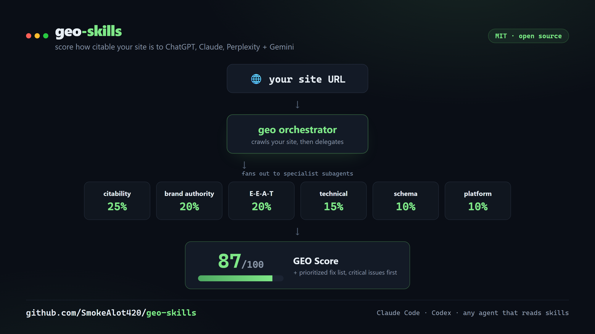

# geo-skills

A free, open-source GEO (Generative Engine Optimization) skill pack. Built as portable Agent Skills - runs in Claude Code, Codex, and other agents that read skill files.



Traditional SEO ranks you in Google's blue links. **GEO gets you quoted inside the AI answer** - by ChatGPT, Claude, Perplexity, Gemini, and Google AI Overviews. This pack scores how citable your site is to those engines and writes you a prioritized fix list. No dashboard subscription, no paid API required. It runs locally in Claude Code.

## What it does

Point the orchestrator at a URL. It crawls your site, runs a panel of specialist subagents, and hands you a single **GEO Score (0-100)**, weighted across 6 categories:

| Category | Weight | What it measures |
|---|---|---|
| AI Citability | 25% | How quotable and extractable your content is for an LLM |
| Brand Authority | 20% | Third-party mentions and entity-recognition signals |
| Content E-E-A-T | 20% | Experience, Expertise, Authoritativeness, Trustworthiness |
| Technical GEO | 15% | AI crawler access, llms.txt, rendering, speed |
| Schema / Structured Data | 10% | Schema.org markup quality and completeness |
| Platform Optimization | 10% | Presence on the platforms AI models cite |

Then it ranks every issue by severity (critical first, quick wins flagged) and gives you a 30-day action plan.

## What's in the pack

**GEO core (the flagship):**

| Skill | What it does |
|---|---|
| `geo` | The orchestrator. Runs a full GEO audit and produces the composite score. |
| `geo-audit` | Full website GEO+SEO audit with parallel subagent delegation. |
| `geo-citability` | Scores content passages (0-100) for AI extractability, suggests rewrites. |
| `geo-crawlers` | Audits robots.txt and headers for AI crawler access (GPTBot, ClaudeBot, PerplexityBot...). |
| `geo-llmstxt` | Validates or generates an `llms.txt` file. |
| `geo-brand-mentions` | Maps where your brand is cited across the web; scores brand authority. |
| `geo-platform-optimizer` | Platform-specific optimization for Google AIO, ChatGPT, Perplexity, Gemini, Copilot. |
| `geo-schema` | Detects, validates, and generates JSON-LD schema for AI entity recognition. |
| `geo-technical` | Technical SEO + GEO checks (crawlability, SSR, rendering, Core Web Vitals). |
| `geo-content` | E-E-A-T and content-quality assessment for AI citability. |
| `geo-report` / `geo-report-pdf` | Business-facing GEO reports (markdown + professional PDF). |
| `geo-proposal` / `geo-prospect` / `geo-compare` | Client tooling: proposals, pipeline, month-over-month deltas (optional, for agencies). |
| `ai-seo` | The GEO strategy guide - the theory, the 3 pillars, platform-specific tactics. |

**Supporting SEO skills:**

`programmatic-seo` · `schema-markup` · `competitor-alternatives` · `seo-audit` · `content-strategy` · `site-architecture`

**Subagents** (in `agents/`, used by the orchestrator): `geo-ai-visibility`, `geo-content`, `geo-platform-analysis`, `geo-schema`, `geo-technical`.

## Compatibility

These are standard Agent Skills - each one is a `SKILL.md` instruction document plus a rubric and output format. That makes them portable:

| Runtime | Status | Notes |
|---|---|---|
| **Claude Code** | Native | Full support, including the orchestrator's parallel subagents. |
| **Codex** | Works | Drop the skills in `~/.codex/skills/`. Run skills directly. |
| **Other agents** (Cursor, Hermes, etc.) | Works | Any agent that loads skill / instruction files can run the individual skills. |

The individual skills (citability, crawlers, schema, content, and the rest) are plain instruction docs - any capable agent that can fetch a URL and write a file can run them. The one Claude Code-native piece is the `geo` orchestrator's **parallel** subagent fan-out (it launches 5 specialists at once). On other runtimes you invoke the skills directly, or the agent runs them in sequence - same checks, same output. The `allowed-tools` frontmatter is advisory and is safely ignored by agents that don't use it.

## Install

See [INSTALL.md](INSTALL.md). Short version: copy `skills/` into your agent's skills directory (`~/.claude/skills/` for Claude Code, `~/.codex/skills/` for Codex) and, on Claude Code, `agents/` into `~/.claude/agents/`. Then:

```
/geo audit https://yoursite.com
```

## Free-first

Every skill in this pack works with no paid API. Where a third-party data tool could help (rank trackers, backlink suites), it is always marked optional and the skill degrades gracefully without it. Research figures cited in the skills come from published studies and are attributed inline.

## License

MIT. See [LICENSE](LICENSE). Built by SmokeDev. PRs welcome - see [CONTRIBUTING.md](CONTRIBUTING.md).
